# Wwwision.Neos.ModuleComponents

[Neos](https://neos.io) package with utilities and components to create Fusion based backend modules with the common look and feel

# Usage

1. In the `composer.json` file of a Neos package (let's assume a package key of `Some.Package`), add the following dependency:

```json
{
  "type": "neos-package",
  "name": "some/package",
  // ...
  "require": {
    // ...
    "wwwision/neos-modulecomponents": "^1"
  }
  // ...
}
```

Afterwards make sure to install the new dependencies by running

```shell
composer update <your-package-name>
```

2. Configure a Neos Backend Module as [documented](https://docs.neos.io/tutorials/creating-a-backend-module-with-fusion-and-fusion-form) via `Settings.yaml`:

```yaml
Neos:
  Neos:
    modules:
      # Will add this submodule module underneath the "administration" main module
      # Alternative main module name is "management", but you can also define completely new main module here
      'administration':
        submodules:
          # The key of this sub module, can be any string and defines the path that is used in the URL and in privilege target definitions
          'some-module':
            label: 'Some Backend module'
            controller: 'Some\Package\Controller\SomeModuleController'
            description: 'Description for the module'
            icon: 'vial'
            additionalResources:
              styleSheets:
                - 'resource://Wwwision.Neos.ModuleComponents/Public/Styles/module.css'
              javaScripts:
                - 'resource://Wwwision.Neos.ModuleComponents/Public/Scripts/module.js'
```

> [!IMPORTANT]  
> Make sure to specify the provided `module.css` and `module.js` as "additionalResources"

3. Provide a corresponding privilege target and grant it to any role that should have access to the module via `Policy.yaml`:

```yaml
privilegeTargets:
  'Neos\Neos\Security\Authorization\Privilege\ModulePrivilege':
    # Define a privilege for the "Example Module" on the basis of its module path (see Settings.Neos.yaml)
    'Some.Package:SomeModule':
      matcher: 'administration/some-module'

roles:
  'Neos.Neos:Administrator':
    privileges:
      # Grant administrators access to the module
      # In custom implementations it could make sense to add a dedicated role for this or to leave privilege allocations completely out of the module package itself (so that it can be done in the integration, e.g. the site package)
      - privilegeTarget: 'Some.Package:SomeModule'
        permission: GRANT
```

4. Create a corresponding MVC controller and override the default View implementation:

```php
<?php
declare(strict_types=1);

namespace Some\Package\Controller;

use Neos\Fusion\View\FusionView;
use Neos\Neos\Controller\Module\AbstractModuleController;

final class SomeModuleController extends AbstractModuleController
{
    protected $defaultViewObjectName = FusionView::class;

    public function indexAction(): void
    {
    }
```

5. Create a corresponding Fusion definition

For example in `<Package-root>/Resources/Private/Fusion/Root.fusion`:

```
Some.Package.SomeModuleController.index = NeosBE:Module {
    content = afx`<p>Hello world</p>`
}
```

6. Navigate to the new backend module

Log in as Neos administrator and navigate to the new module via the module navigation, or head straigt to `/neos/administration/some-module`

## Localization

By setting the flag `translateContent` of the `NeosBE:Module` component, all strings prefixed with "LLL:" will be translated.
By default, the translation files are expected in the path `Resources/Private/Translations/<locale>/Modules.xlf`

See [documentation](https://docs.neos.io/guide/manual/rendering/translating-text-in-fusion) for more details.

### Example

```
Some.Package.SomeModuleController.index = NeosBE:Module {
    translateContent = true
    content = afx`<p>LLL:translateMe</p>`
    footer = afx`<NeosBE:Button content="LLL:andMe" />`
}
```

**Note:** This will also work for *flash messages*:

```php
$this->addFlashMessage('LLL:flashMessage.someFlashMessage');
```

A corresponding XLIFF file at `<Package-root>/Resources/Private/Translations/en/Modules.xlf` could look like this:

```xml
<?xml version="1.0" encoding="UTF-8"?>
<xliff version="1.2" xmlns="urn:oasis:names:tc:xliff:document:1.2">
    <file original="" product-name="Some.Package" source-language="en" datatype="plaintext">
        <body>
            <trans-unit id="translateMe" xml:space="preserve">
				<source>Translated</source>
			</trans-unit>
            <trans-unit id="andMe" xml:space="preserve">
				<source>Also translated</source>
			</trans-unit>
            <trans-unit id="flashMessage.someFlashMessage" xml:space="preserve">
				<source>This is some translated flash message</source>
			</trans-unit>
        </body>
    </file>
</xliff>
```

> [!TIP]  
> If the "LLL:" prefix makes it into the output, the `translateContent` prop is probably not set on the `NeosBE:Module` component
> If the output contains "[someString]" the corresponding translation item could not be found – check id, file paths and locale!

For more advanced localization options (different locales, quantities, different source path) the [NeosBE:Translate](#translate) component can be used!

## Example package

See [Wwwision.Neos.ExampleModule](https://github.com/bwaidelich/Wwwision.Neos.ExampleModule) for an example Neos Module that demonstrates most of the [Components](#components) provided by this package.

## Typography

In contrast to the default Neos backend style, the CSS file provided with this package adds different headline font sizes and default styling for unordered and ordered lists:

### Headings

<a href="Docs/headings.png" target="_blank">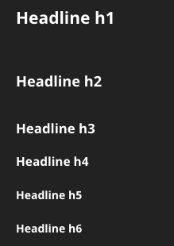</a>

```xml
<h1>Headline h1</h1>

<h2>Headline h2</h2>

<h3>Headline h3</h3>

<h4>Headline h4</h4>

<h5>Headline h5</h5>

<h6>Headline h6</h6>
```

### List items

<a href="Docs/lists.png" target="_blank">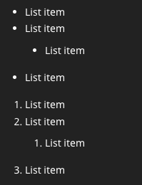</a>

```xml
<ul>
    <li>List item</li>
    <li>List item
        <ul>
            <li>List item</li>
        </ul>
    </li>
    <li>List item</li>
</ul>

<ol>
    <li>List item</li>
    <li>List item
        <ol>
            <li>List item</li>
        </ol>
    </li>
    <li>List item</li>
</ol>
```

# Components

## Badge

A simple badge aka label, potentially with custom error level

### Example

<a href="Docs/badge.png" target="_blank">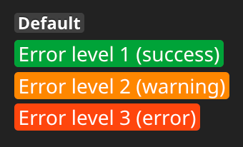</a>

```xml
<NeosBE:Badge>Default</NeosBE:Badge>
<NeosBE:Badge errorLevel="1">Error level 1 (success)</NeosBE:Badge>
<NeosBE:Badge errorLevel="2">Error level 2 (warning)</NeosBE:Badge>
<NeosBE:Badge errorLevel="3">Error level 3 (error)</NeosBE:Badge>
```

## Button

A button that can be used as

* Link to actions of the current module
* Link to other modules
* Trigger to show a modal
* Submit button for forms

### Example

<a href="Docs/button.png" target="_blank">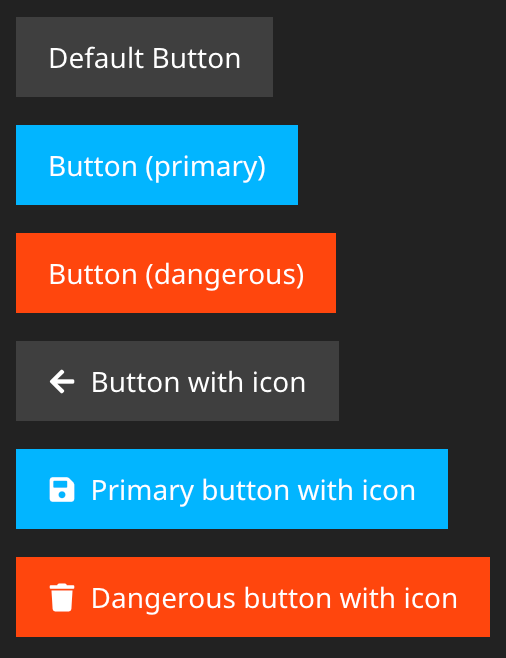</a>

```xml
<NeosBE:Button>Default Button</NeosBE:Button>
<NeosBE:Button isPrimary={true}>Button (primary)</NeosBE:Button>
<NeosBE:Button isDangerous={true}>Button (dangerous)</NeosBE:Button>
<NeosBE:Button icon="arrow-left">Button with icon</NeosBE:Button>
<NeosBE:Button icon="save" isPrimary={true}>Primary button with icon</NeosBE:Button>
<NeosBE:Button icon="trash" isDangerous={true}>Dangerous button with icon</NeosBE:Button>
```

## FlashMessage

Renders and removes flash messages as unordered list

**Note:** This component is used by `NeosBE:Module` and usually does not have to be added manually

### Example

<a href="Docs/flashmessages.png" target="_blank">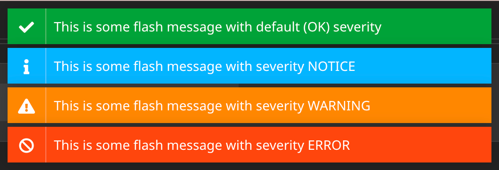</a>

```xml
<NeosBE:FlashMessages attributes.id="neos-notifications-inline" @children="content.itemRenderer">
    <li data-type={String.toLowerCase(flashMessage.severity)}>{flashMessage}</li>
</NeosBE:FlashMessages>
```

## Icon

Renders and removes flash messages as unordered list

**Note:** This component is used by `NeosBE:Module` and usually does not have to be added manually

### Example

<a href="Docs/icon.png" target="_blank"></a>

```xml
<NeosBE:Icon icon="check-circle"/>
```

## Modal

Modal dialog that is hidden by default and can be shown via the `Button` component

**Note:** To display a form within a modal, use the [ModalForm](#modalform) component

### Example

<a href="Docs/modal.png" target="_blank">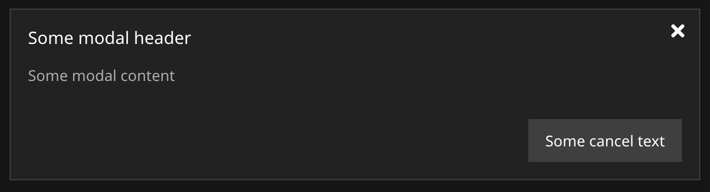</a>

```xml
<NeosBE:Modal id="some-modal">
    <NeosBE:Modal.Header header="Some modal header">
        Some modal content
    </NeosBE:Modal.Header>
    <NeosBE:Modal.Footer cancelButtonText="Some cancel text"/>
</NeosBE:Modal>
// ...
<NeosBE:Button modal="some-modal">Show modal</NeosBE:Button>
```

## ModalForm

Modal dialog containing a Form that is hidden by default and can be shown via the `Button` component

### Example

<a href="Docs/modalform.png" target="_blank">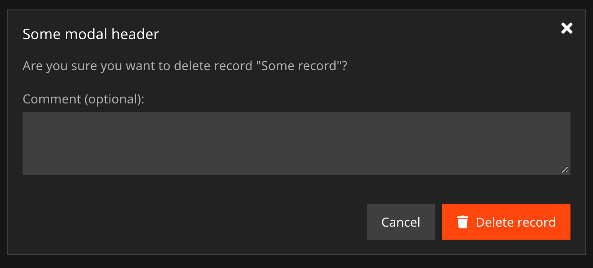</a>

```xml
<NeosBE:ModalForm id="some-form-modal" header="Some modal header" cancelButtonText="Cancel" submitButtonIcon="trash" submitButtonText="Delete record" isDangerous={true} form.target.action="delete" form.target.arguments={{id: someRecord.id}}>
    Are you sure you want to delete record "{someRecord.title}"?<br/>
    <br/>
    <Neos.Fusion.Form:Neos.BackendModule.FieldContainer field.name="form[comment]" label="Comment (optional):">
        <Neos.Fusion.Form:Textarea attributes.class="neos-span12" attributes.style="height: 5em; resize: vertical"/>
    </Neos.Fusion.Form:Neos.BackendModule.FieldContainer>
</NeosBE:ModalForm>
// ...
<NeosBE:Button modal="some-form-modal">Show modal</NeosBE:Button>
```

## Module

The root component used to render the backend module content for one MVC action

### Example

```xml
Some.Package.SomeController.index = NeosBE:Module {
    content = 'main content'
}
```

With the `translateContent` prop set to `true`, "LLL:<id>" strings in flash messages, main and footer content will be replaced using the \Wwwision\Neos\ModuleComponents\Eel\I18nHelper::translateContent() Eel helper:

```xml
Some.Package.SomeController.someOtherAction = NeosBE:Module {
    translateContent = true
    content = afx`
        <NeosBE:Badge>This will be LLL:translated</NeosBE:Badge>
    `
    footer = afx`
        <NeosBE:Button action="index" icon="eye">LLL:alsoTranslated</NeosBE:Button>
    `
}
```

## ModuleLink

A link pointing to a different Neos Backend Module

### Example

```xml
<NeosBE:ModuleLink module="administration/users" action="new">Add new user</NeosBE:ModuleLink>
<NeosBE:ModuleLink module="management/media" arguments.view="list" arguments.orderBy="Name" arguments.filter="Document">List documents</NeosBE:ModuleLink>
```

## Pagination

Page navigation usually combined with a `NeosBE:Table` component

### Example

<a href="Docs/pagination.png" target="_blank">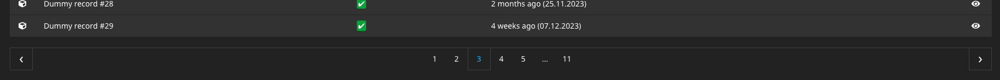</a>

```xml
<NeosBE:Pagination numberOrResults={records.count} />
<NeosBE:Pagination numberOrResults={records.count} resultsPerPage={30} queryParameter="p" />
```

## RelativeTime

A DateTime value that is rendered as relative time using `Intl.RelativeTimeFormat()` on the client side
See https://developer.mozilla.org/en-US/docs/Web/JavaScript/Reference/Global_Objects/Intl/RelativeTimeFormat

### Example

```
<NeosBE:RelativeTime dateTime={someDateTime} />
<NeosBE:RelativeTime dateTime={someDateTime} formatFallback="Y-m-d H:i" />
<NeosBE:RelativeTime dateTime={someDateTime} options.numeric="always" options.style="narrow" />
```

## Table

This package contains a collection of components to render arbitrary tables

### Example - Basic

<a href="Docs/table_01.png" target="_blank">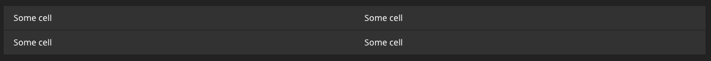</a>

```xml
<NeosBE:Table>
    <NeosBE:Table.Row>
        <NeosBE:Table.Cell>Some cell</NeosBE:Table.Cell>
        <NeosBE:Table.Cell>Some cell</NeosBE:Table.Cell>
    </NeosBE:Table.Row>
    <NeosBE:Table.Row>
        <NeosBE:Table.Cell>Some cell</NeosBE:Table.Cell>
        <NeosBE:Table.Cell>Some cell</NeosBE:Table.Cell>
    </NeosBE:Table.Row>
</NeosBE:Table>
```

### Example - Clickable Row

<a href="Docs/table_02.png" target="_blank">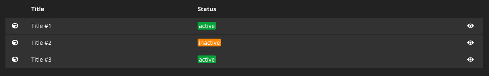</a>

```xml
<NeosBE:Table>
    <NeosBE:Table.Head>
        <NeosBE:Table.Row>
            <NeosBE:Table.HeaderCell content="" attributes.style="width: 1em"/>
            <NeosBE:Table.HeaderCell content="Title"/>
            <NeosBE:Table.HeaderCell content="Status"/>
            <NeosBE:Table.HeaderCell content=""/>
        </NeosBE:Table.Row>
    </NeosBE:Table.Head>
    <NeosBE:Table.Body>
        <Neos.Fusion:Loop items={[{"id": 1, "active": true}, {"id": 2, "active": false}, {"id": 3, "active": true}]}>
            <NeosBE:Table.ClickableRow target.action="show" target.arguments={{id: item.id}}>
                <NeosBE:Table.Cell>
                    <NeosBE:Icon icon="cube"/>
                </NeosBE:Table.Cell>
                <NeosBE:Table.Cell>
                    Title #{item.id}
                </NeosBE:Table.Cell>
                <NeosBE:Table.Cell>
                    <NeosBE:Badge errorLevel={item.active ? 1 : 2}>{item.active ? 'active' : 'inactive'}</NeosBE:Badge>
                </NeosBE:Table.Cell>
                <NeosBE:Table.ActionCell>
                    <NeosBE:Button icon="eye" action="show" arguments={{id: item.id}}/>
                </NeosBE:Table.ActionCell>
            </NeosBE:Table.ClickableRow>
        </Neos.Fusion:Loop>
    </NeosBE:Table.Body>
</NeosBE:Table>
```

### Example - Collapsed Row

<a href="Docs/table_03.png" target="_blank">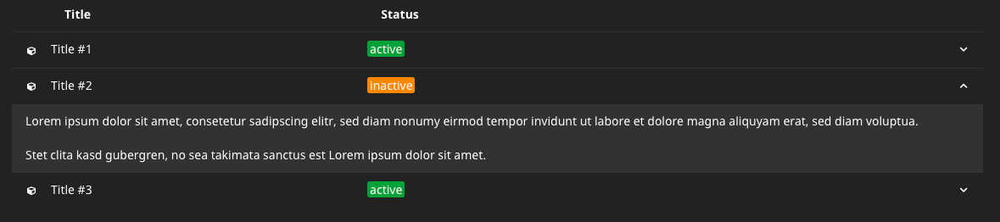</a>

```xml
<NeosBE:Table>
    <NeosBE:Table.Head>
        <NeosBE:Table.Row>
            <NeosBE:Table.HeaderCell content="" attributes.style="width: 1em"/>
            <NeosBE:Table.HeaderCell content="Title"/>
            <NeosBE:Table.HeaderCell content="Status"/>
            <NeosBE:Table.HeaderCell content=""/>
        </NeosBE:Table.Row>
    </NeosBE:Table.Head>
    <NeosBE:Table.Body>
        <Neos.Fusion:Loop items={[{"id": 1, "active": true}, {"id": 2, "active": false}, {"id": 3, "active": true}]}>
            <NeosBE:Table.FolderRow>
                <NeosBE:Table.Cell>
                    <NeosBE:Icon icon="cube"/>
                </NeosBE:Table.Cell>
                <NeosBE:Table.Cell>
                    Title #{item.id}
                </NeosBE:Table.Cell>
                <NeosBE:Table.Cell>
                    <NeosBE:Badge errorLevel={item.active ? 1 : 2}>{item.active ? 'active' : 'inactive'}</NeosBE:Badge>
                </NeosBE:Table.Cell>
                <NeosBE:Table.ActionCell>
                    <NeosBE:ToggleButton target={"details_item_" + item.id}/>
                </NeosBE:Table.ActionCell>
            </NeosBE:Table.FolderRow>
            <NeosBE:Table.CollapsedRow id={"details_item_" + item.id}>
                <NeosBE:Table.Cell attributes.colspan="4">
                    Lorem ipsum dolor sit amet, consetetur sadipscing elitr, sed diam nonumy eirmod tempor invidunt ut labore et dolore magna aliquyam erat, sed diam voluptua.<br/>
                    Stet clita kasd gubergren, no sea takimata sanctus est Lorem ipsum dolor sit amet.
                </NeosBE:Table.Cell>
            </NeosBE:Table.CollapsedRow>
        </Neos.Fusion:Loop>
    </NeosBE:Table.Body>
</NeosBE:Table>
```

## ToggleButton

A button that can be used to toggle visibility of other HTML elements or components

### Example

```xml
<NeosBE:ToggleButton target="target-element" />
<div id="target-element" class="neos-hide">This is hidden by default</div>
```

> [!NOTE]  
> This button is commonly used to expand `NeosBE:Table.CollapsedRow` components, see example above

## Translate

A component to translate strings using XLIFF

> [!NOTE] 
> By default, corresponding translation files are expected in `<Package-root>/Resources/Private/Translations/<locale>/<Source>.xlf`

> [!TIP]
> For simple cases "LLL:"-prefixed strings can be used instead of this component, see [Localization](#localization)

### Example

```xml
<NeosBE:Translate id="someLabel" />
<NeosBE:Translate id="someLabelWithPlaceholders" arguments={['first', 'second']} />
<NeosBE:Translate id="someLabelWithPluralForms" quantity={numberOfResults} />
<NeosBE:Translate id="someLabelFromADifferentSource" source="Main" />
```

# Contribution

Contributions in the form of issues or pull requests are highly appreciated.

# License

See [LICENSE](./LICENSE)
